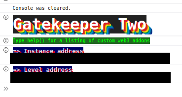
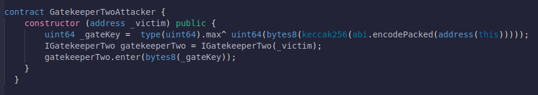
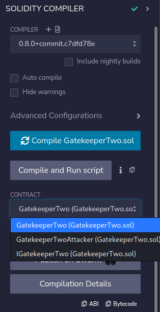
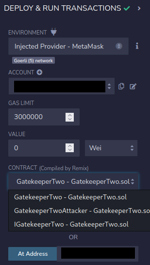
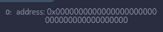
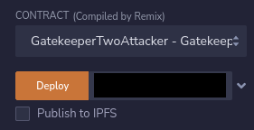
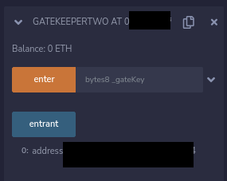

# 14: GatekeeperTwo :checkered_flag:#2
The Ethernaut is a Web3/Solidity based wargame inspired by https://overthewire.org, played in the Ethereum Virtual Machine, in which each level is based on a smart contract that needs to be "hacked".

This is a sample walkthrough for the level called "GatekeeperTwo".

## Setup :beginner:
First off we need a wallet. Get the Metamask Wallet from https://metamask.io/ and choose whichever network works for you ( in my case i will be using Goerli's testnet).
Fund the wallet with Alchemy's faucet https://goerlifaucet.com and then click on the button "Get new instance" to deploy the contract.

## Steps for completing the level :star2:
Click on F12 to get on Developer Tools. You will get something like this:

Copy the GatekeeperTwo.sol contract found before "submit instance" and "get new instance" buttons.

Go on Remix: https://remix.ethereum.org/ and prepare to make some changes in GatekeeperTwo.sol.

This level asks us to pass all the 3 gates to become an entrant, similar to what we had in the [GatekeeperOne](https://github.com/Spyro7883/13-GatekeeperOne) contract. Let's start with the first requirement then advance to the last one.

For the first gate we are going to use the same trick from the [04-Telephone](https://github.com/Spyro7883/04-Telephone) level.

Let's first on build an interface called IGatekeeperTwo, that we are going to use together with the GatekeeperTwoAttacker contract:
>- <value> function enter(bytes8 _gateKey) external returns (bool);

To call the enter function from IGatekeeperTwo we need to define the gatekeeperTwo variable to our GatekeeperTwoAttacker contract:

>- <value> IGatekeeperTwo gatekeeperTwo = IGatekeeperTwo(_victim);
>- <value> gatekeeperTwo.enter(bytes8(_gateKey));

The second gate it's much more easier compared to what we had to work with in the GatekeeperOne level. 

GateTwo is marked by an assembly block, that contains Yul programming language and accesses the Ethereum Virtual Machine at a low level. This gate checks the size of caller's contract code with **x := extcodesize(caller())**, which means that the only way to pass this modifier is to declare the whole attack function of GatekeeperTwoAttacker into a constructor, since during it's initialization the runtime code is always 0 :
>- <value> constructor(address _victim) public 

Now for the third gate we will need some creativity to resolve this, since we need to find out the value of _gateKey :

Let's name 1 = uint64(bytes8(keccak256(abi.encodePacked(msg.sender)))), 0 = uint64(_gateKey) and 1 = type(uint64).max:
>- <value> We know that 1 == 1 ^ 0 <=> 0 == 1 ^ 1

Which should mean that:
>- <value> uint64 _gateKey =  uint64(bytes8(keccak256(abi.encodePacked(msg.sender)))) ^ type(uint64).max;

Let's create the GatekeeperTwoAttacker contract:

Compile the GatekeeperTwo.sol contract:

Now let's interact with the already deployed contract by using instance's address showed on Developer Tools. Also, dont forget to add your wallet on Environment by selecting "Injected Provider - Metamask".

Check the entrant function:

 Go and deploy our GatekeeperTwoAttack contract with the _victim's address: 

Try again the entrant function:

Wow, congrats!! You have managed to pass all three gates, became an entrant and also have completed this level.

Now finish the level by using the submit button at the bottom of the page.

Congrats! See you on to the next level.:wave: